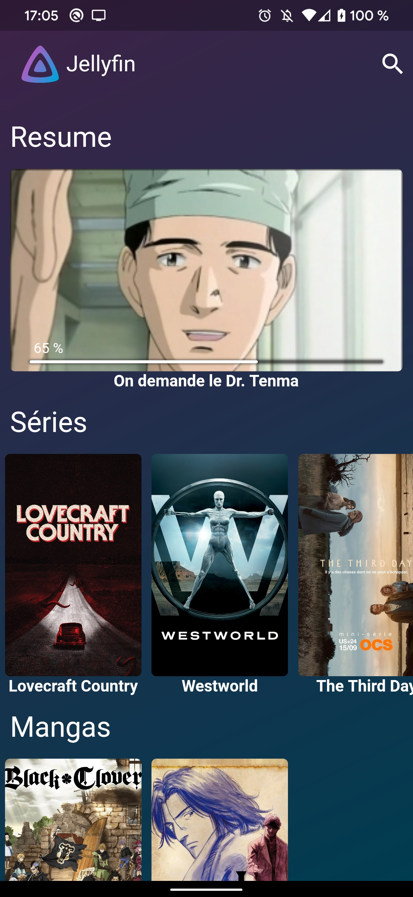
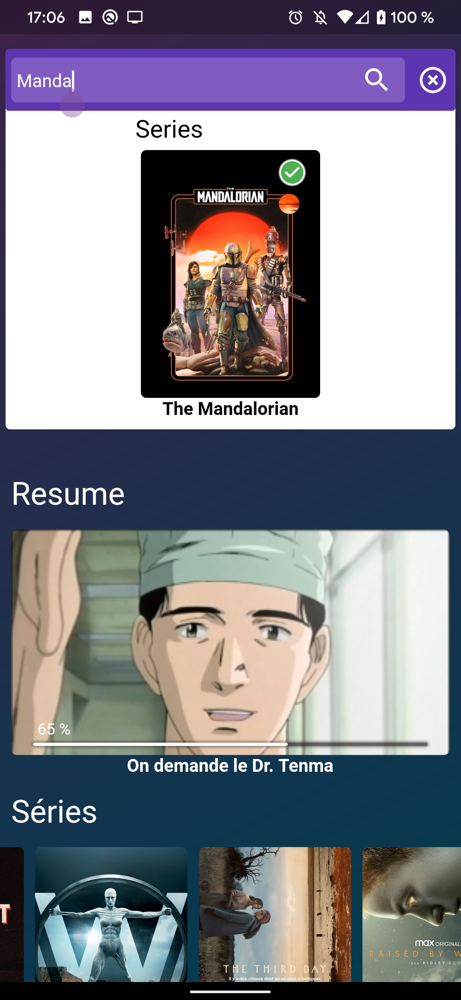
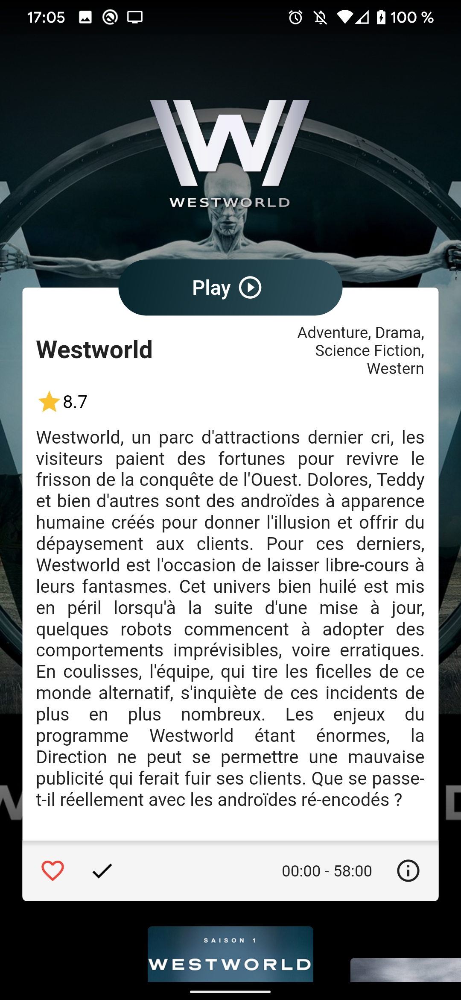
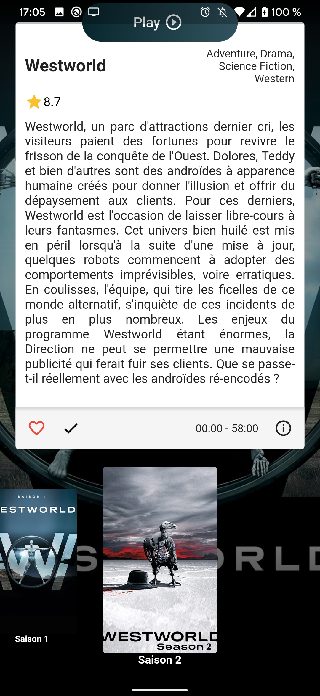
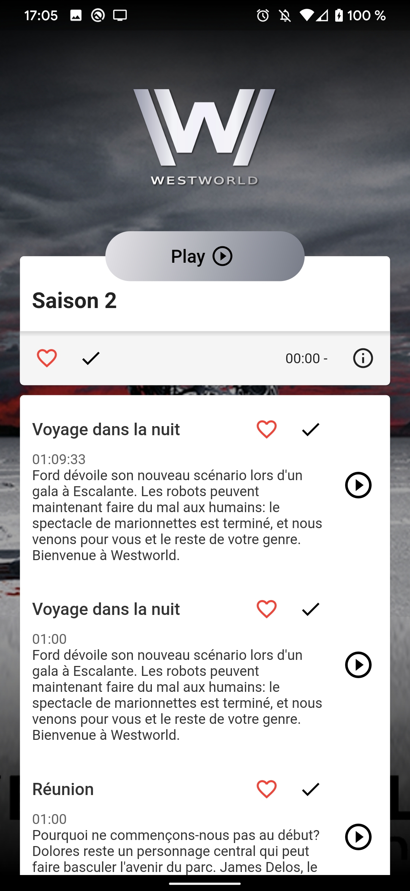
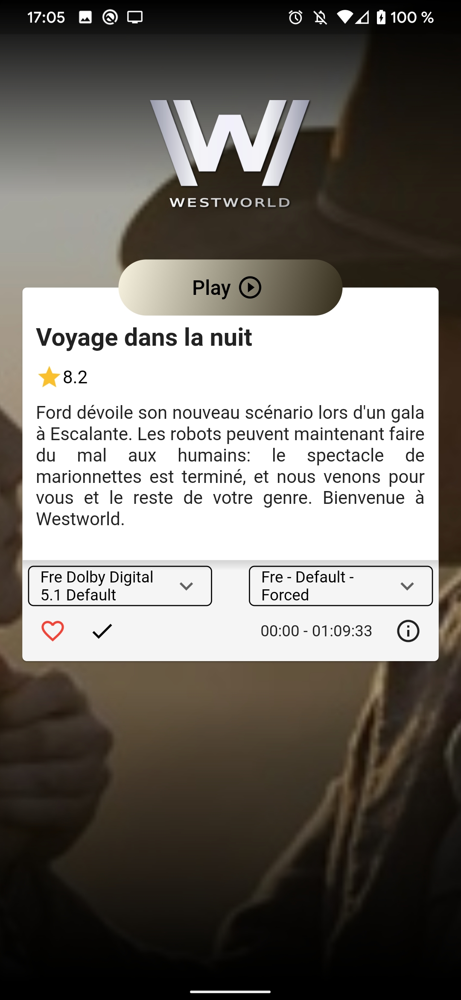
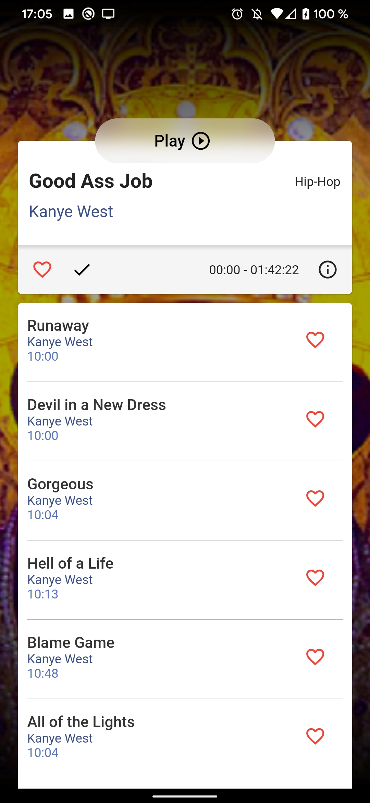

# jellyflut

A jellyfin client made in Flutter

It's a beta, it works okay.
 
You can :
- [x] Play a video
- [x] Read a book (WIP work only in debug)
- [x] Listen Music (WIP, only notification to control)

## Todo

- [x] SQLite to have logging and to save server URL
- [x] Browse all files (for now only the first item of a collection)
- [x] ~~BIGGEST THING TO DO make transcoding work, for now i don't know how to check if file can be direct play and if no how to tell jellyfin to send me the correct url~~ It works (mostly)
- [x] Control music from any screen
- [ ] Extract or/and parse subtitles from video file (depend on https://pub.dev/packages/better_player)
- [ ] Correct all flutter things, make things faster
  - [x] Hero animation OK
  - [x] Async details loading
  - [ ] Navigation details back stutter
  - [ ] other things...

## Screens
<div style="display: flex">
 
 
 
 
 
 
 
 
</div>

## Getting Started

How to test ?

```bash
git clone https://github.com/Thomas-Sohier/jellyflut.git
cd jellyflut
flutter packages get
flutter packages upgrade
flutter run
```

How to build ? (Android)

```bash
flutter build apk --release
```
