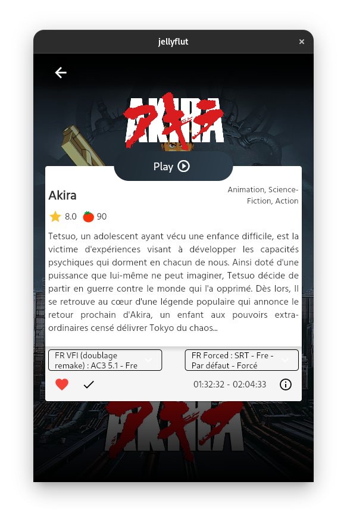
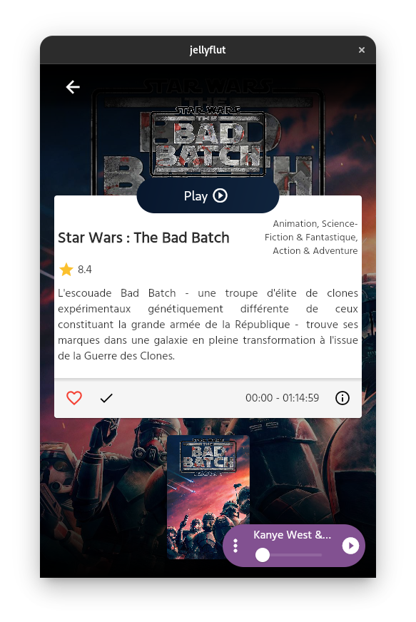
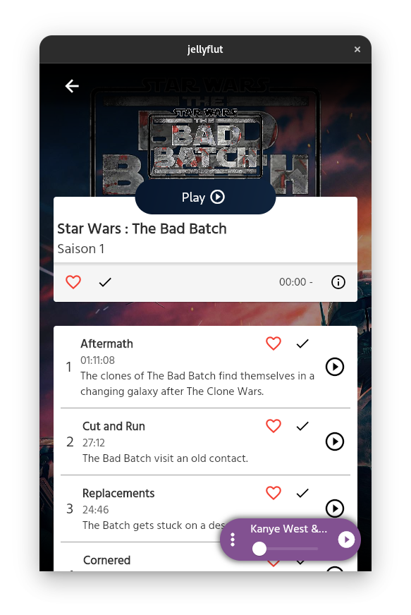
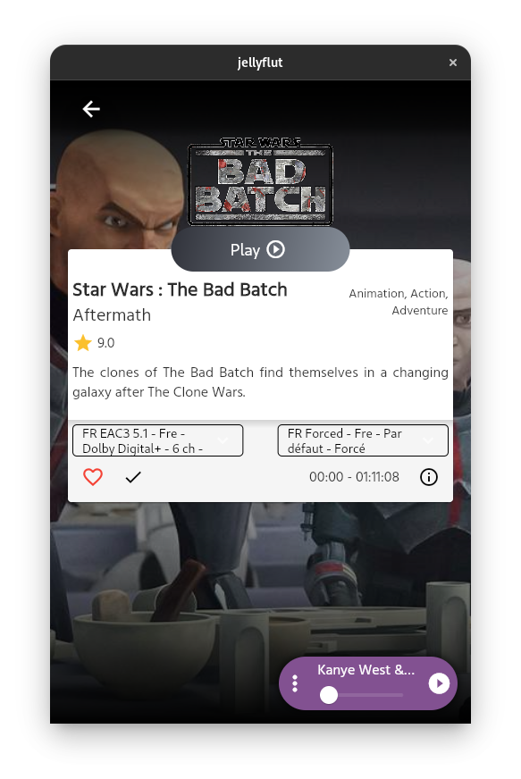
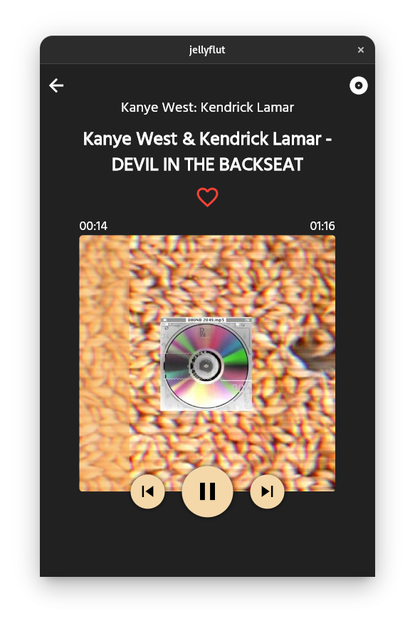
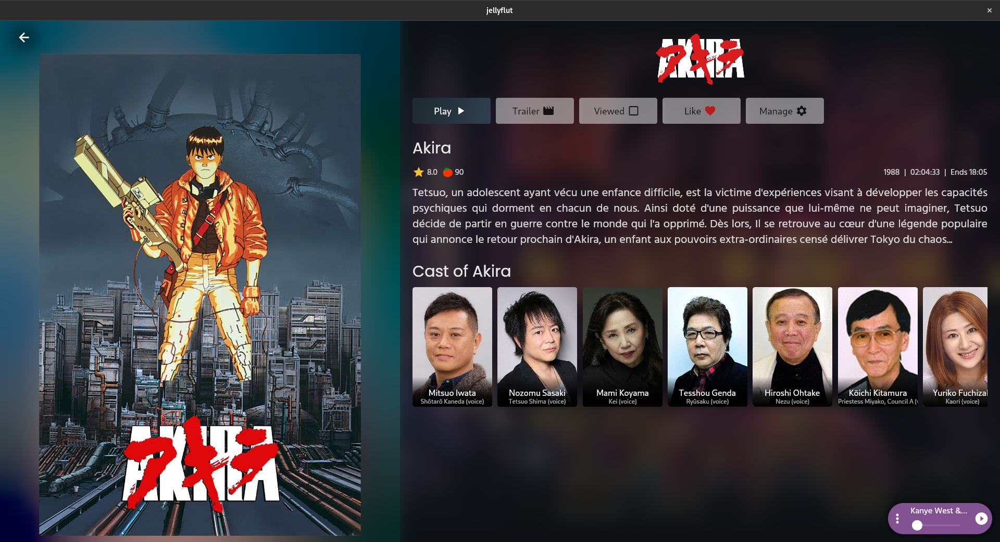
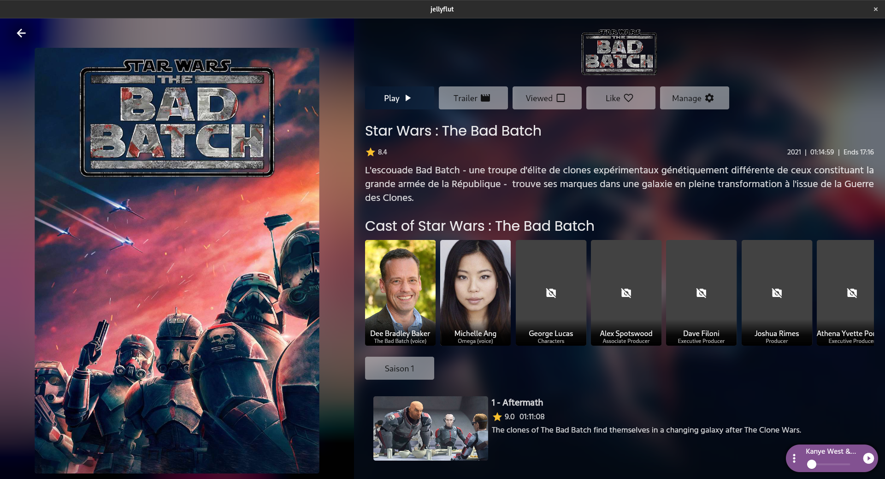
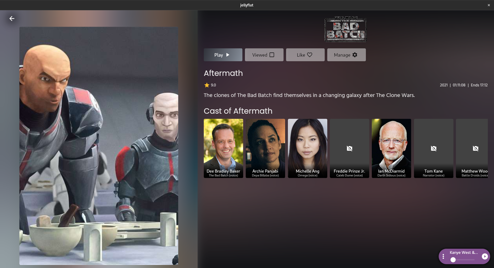
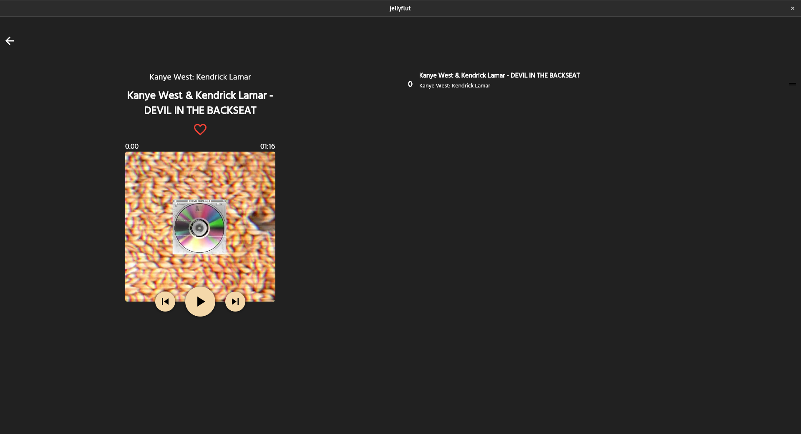

# jellyflut

A jellyfin client made in Flutter

It's a beta, it works okay.
 
You can :
- [x] Play a video
- [x] Read a book 
- [x] Listen Music
- [x] Look photos
- [x] SQLite to have logging and to save server URL
- [x] Browse all files
- [x] ~~BIGGEST THING TO DO make transcoding work, for now i don't know how to check if file can be direct play and if no how to tell jellyfin to send me the correct url~~ It works
- [x] Control music from any screen
- [x] Extract or/and parse subtitles from video file
 - Only remote srt, cannot parse from mkv file (except in VLC)

## Todo

- [ ] Correct all flutter things, make things faster
  - [x] Hero animation OK
  - [x] Async details loading
  - [x] Navigation details back stutter
  - [x] Responsive (WIP)
  - [] Handle multiple users and servers
  - [] Add deconnect button and handle it well
  - [] Rework login page

## Screens

 

### Phone

<div style="display: flex">
 
 
 
 
 
</div>

### Desktop

<div style="display: flex">
 
 
 
 
</div>

## Getting Started

This app should work on any platform but IOS and MacOs are not tested.

### How to test ?

```bash
  git clone https://github.com/Thomas-Sohier/jellyflut.git
  cd jellyflut
  flutter packages get
  flutter packages upgrade
  flutter run
```

### How to build ? (Android)

```bash
  flutter build apk --release
```

### How to build ? (Computer, depending of platform)

Specific to Linux, you need to install dep

```bash
  # depend of your distro of course
  sudo apt-get update -y
  sudo apt-get install -y vlc libvlc-dev ninja-build clang libgtk-3-dev
```

```bash
  # enable desktop support at first (shouldn't be necessary but anyway)
  flutter config --enable-windows-desktop
  flutter config --enable-macos-desktop
  flutter config --enable-linux-desktop

  # build the app depending of your platform
  flutter build windows
  flutter build macos
  flutter build linux
```