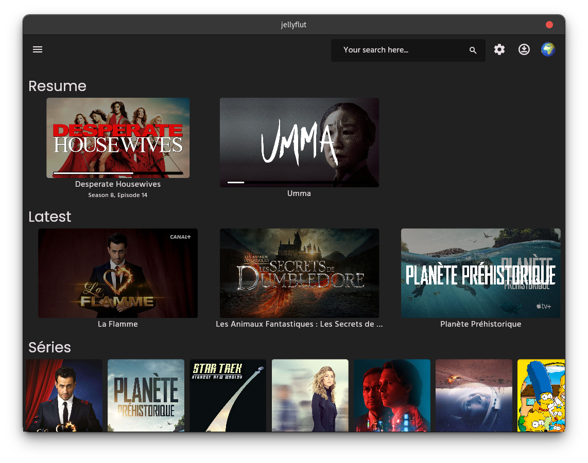
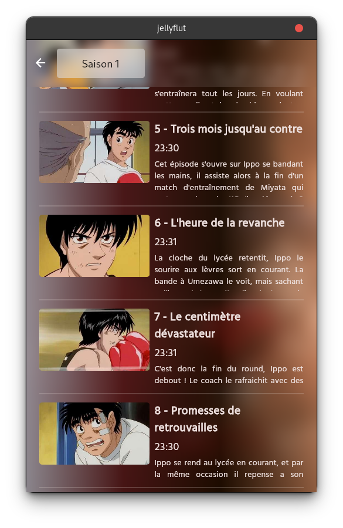
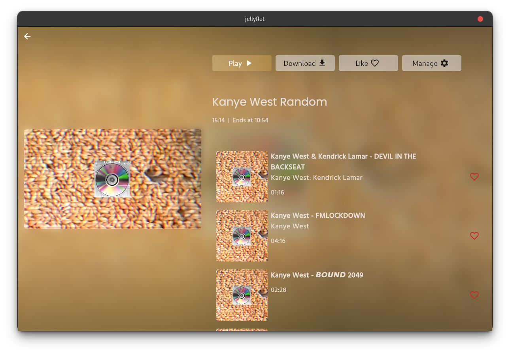

# Jellyflut

A jellyfin client made in Flutter

It's a beta, it works okay.

## :warning: News
 
The project is stale for now. I don't have much time and interest in this project for now. Video player are too much pain in FLutter. I'm still looking for solutions but as of now, I'm going to slow down the developpement of this app.

I'm still looking for any PR and will gladly accept them.
 
## :gear: Features

You can :
- [x] Play a video
- [x] Read a book (epub/CBZ)
  - Epub is pretty limited for now as it's a juste a parser combined with an HTML viewer
  - need some work
- [x] Listen Music
  - Buggy on Linux (need to investigate, or to use another package for linux )
- [x] Look photos
- [x] SQLite to have logging and to save server URL
- [x] Browse all files
- [x] ~~BIGGEST THING TO DO make transcoding work, for now i don't know how to check if file can be direct play and if no how to tell jellyfin to send me the correct url~~ It works (not much anymore, broken since 10.8.0 beta 3)
  - Do not works correctly on Windows (seems broken due to libvlc dll, certificate issue)
  - On computer I added supported codec manually. Some codecs can be missing, if so, create an issue and I will check if it's playable
- [x] Control music from any screen
- [x] Extract or/and parse subtitles from video file
 - Only remote srt, cannot parse from mkv file (except in VLC)

## Done
  - [X] Add deconnect button and handle it well
  - [X] Rework login page
  - [x] Hero animation OK
  - [x] Async details loading
  - [x] Navigation details back stutter
  - [x] Responsive (WIP)
  - [x] Navigation with D-pad (seems ok but web can still select things from outside of the screen on home page)
    - Still need more works but you can navigate 80% of app which is sufficient for now
  - [x] Handle multiple users and servers
  - [x] Have a better handling of data when resizing to avoid reload from API
    - Seems pretty good right now, may need more works in future
  - [X] Theme (dark/light)
  - [X] Localization (ENG,FR,DE)

## Todo
  - [ ] Always refactor everything
  - [ ] Add unit test
  - [ ] Correct "transcodeReasons=0" from jellyfin
  - [ ] Correct all flutter things, make things faster
  - [ ] Make IPTV on par with web version
    - Guide is working
    - Can play IPTV channels
    - still need to add recording

## Screens

 

### Phone

<div style="display: flex">
 
 
</div>

### Desktop

<div style="display: flex">
 
 
 
</div>

## Getting Started

This app should work on any platform but IOS and MacOs are not tested.

### How to test ?

```bash
  git clone https://github.com/Thomas-Sohier/jellyflut.git
  cd jellyflut
  flutter packages get
  flutter packages upgrade
  flutter run
```

### How to build ? (Android)

```bash
  flutter build apk --release
```

### How to build ? (Computer, depending of platform)

Specific to Linux, you need to install dep

```bash
  # depend of your distro of course
  sudo apt-get update -y
  sudo apt-get install -y vlc libvlc-dev ninja-build clang libgtk-3-dev
```

```bash
  # enable desktop support at first (shouldn't be necessary but anyway)
  flutter config --enable-windows-desktop
  flutter config --enable-macos-desktop
  flutter config --enable-linux-desktop

  # build the app depending of your platform
  flutter build windows
  flutter build macos
  flutter build linux
```
